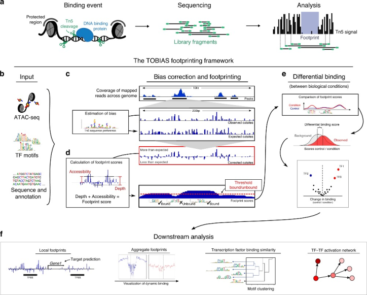

# Application of TOBIAS for ATAC-seq data analysis and TF-TF interactive networks creation

## Background knowledge

**1. ATAC-seq (Assay for Transposase-Accessible Chromatin using sequencing)** is a technique used to study chromatin accessibility across the genome. It employs a transposase enzyme that inserts sequencing adapters into open, accessible regions of DNA, allowing researchers to identify active regulatory elements such as promoters and enhancers. 

The principle of ATAC-seq:

**2. TOBIAS (Transcription factor Occupancy prediction By Investigation of ATAC-seq Signal)** is a computational tool used with ATAC-seq data to predict transcription factor binding sites. By accounting for chromatin accessibility and footprinting, TOBIAS improves the accuracy of identifying transcription factor occupancy, enabling deeper insights into gene regulation and cell-specific regulatory networks.

TOBIAS workflow: 

TOBIAS principle:

## Description
This repository contain:

(1) The test script to run the test data from the TOBIAS repository: https://github.com/loosolab/TOBIAS in The University of Manchester CFS3 (Computational Share Facility 3). 

(2) The scripts for data processing and applying TOBIAS to the analysis of ATAC-seq data of the health and patient CD4 and CD8 cell samples to decipher TF-binding regulatory mechanism responsible for Psoriatic Arthritis (PsA).

## Workflow
